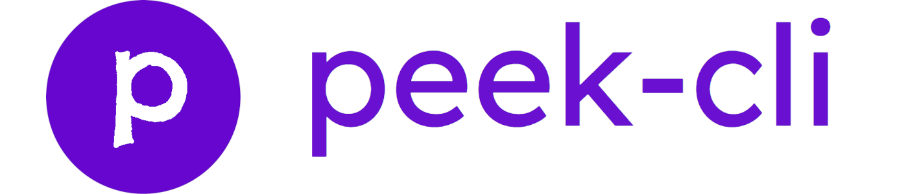
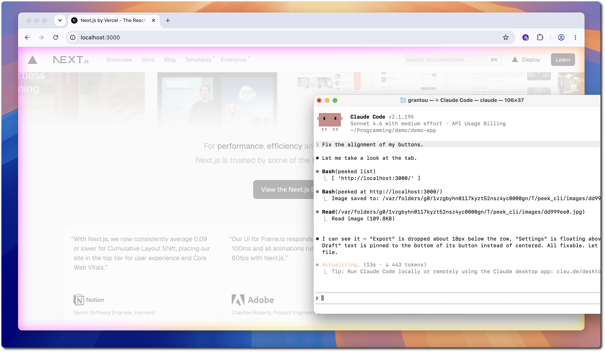
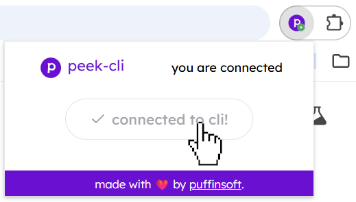
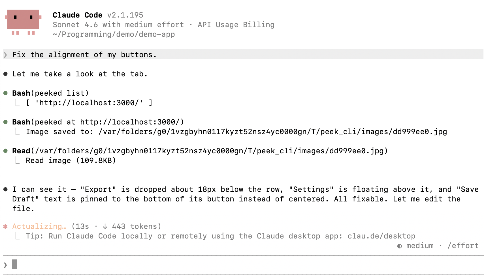

<p align="center">
    
</p>

<p align="center">
peek-cli allows agents to capture a screenshot of any open tab in your browser.
</p>

---

<p align="center">
Works with Claude Code, Codex, Copilot and many more...
</p>



<p align="center">
It works by using a browser extension to stream screenshots over WebSockets.
</p>

---

### Usage

*For security, you need to connect the agent once on every startup.*

1. Start the WebSocket daemon:

```bash
peeked start
> Successfully started server.
```

2. Connect your browser:



3. You're good to go!

```bash
peeked list # view available tabs
> [ 'http://localhost:3000/' ]

peeked at http://localhost:3000 # capture screenshot
> Image saved to: /var/.../peek_cli/images/dd999ee0.jpg
```

---

### Installation

1. Install the [Chrome Extension](https://chromewebstore.google.com/detail/peek-cli/fekplnpejnpnfmgikkleldnncgickmbb).

<sup>🎉 the extension has been approved on the Chrome Web Store!</sup>

2. Install the CLI

```bash
npm i -g peeked
```

3. Install the Skill

For Claude Code:
```bash
/plugin marketplace add puffinsoft/peek-cli
/plugin install view-browser-tab@peek-cli
```

For Codex:

```bash
codex plugin marketplace add puffinsoft/peek-cli
codex plugin add view-browser-tab@peek-cli
```

---

### Examples



---

### ⚠️ Is this safe?

Yes, 100%. It is impossible for the agent to do anything **but take a screenshot**.

This is because the agent sends *screenshot requests* to the extension through a WebSocket server.

It never accesses the browser and cannot inject any scripts / perform any actions.

We invite you to take a look at the extension [source code](src/extension/background.ts) for added peace of mind.

---

peek-cli is open source software, licensed under the [MIT](LICENSE) license.
